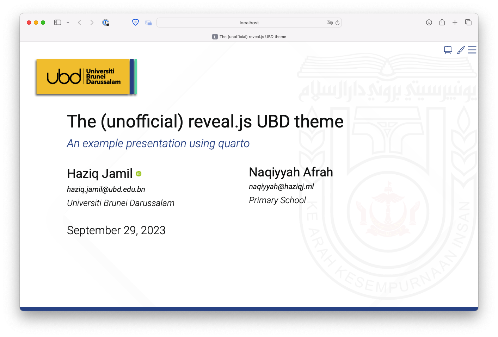

# Quarto clean theme



The **UBD reveal.js Theme** is a modern and minimal theme designed for getting information across in a clean and uncluttered manner.

This theme is based on the [Quarto Clean Theme ](https://github.com/grantmcdermott/quarto-revealjs-clean) by [Grant McDermott](https://grantmcdermott.com), with its logos and fonts changed, and colour scheme adapted to UBD's official brand colours.

## Use

This document was created using [quarto](https://quarto.org/docs/presentations/revealjs/). 
Depending on your use case, here are some [Quarto CLI](https://quarto.org/)
commands to get started.

If you would like to add the **UBD** theme to an existing directory, run this command in the terminal:

```bash
quarto install extension haziqj/quarto-revealjs-ubd
```

Alternatively, you can use a
[Quarto template](https://quarto.org/docs/extensions/starter-templates.html)
that bundles the **clean** theme plus a .qmd starter document. 
The demo presentation has been provided as a template.
Run the following command in the terminal:

```bash
quarto use template haziqj/quarto-revealjs-ubd
```

## Publishing quarto documents

There are several ways of publishing quarto documents. I typically use GitHub actions to do it. See here: https://quarto.org/docs/publishing/github-pages.html#github-action
